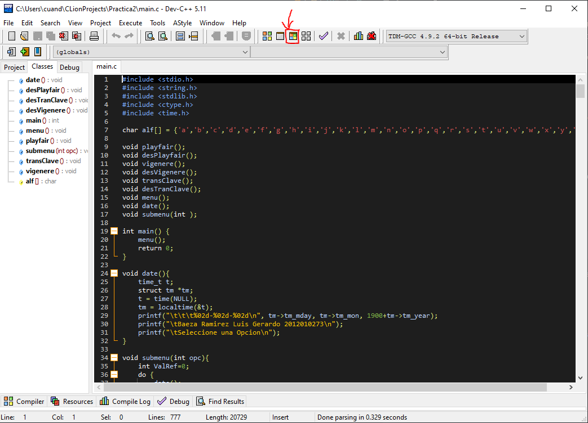
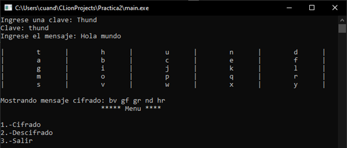
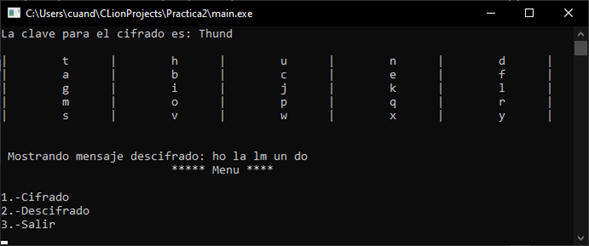
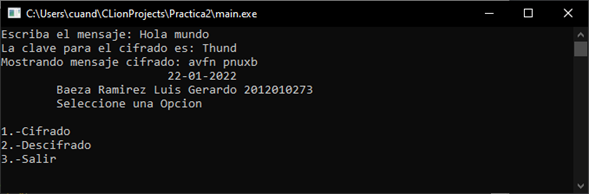
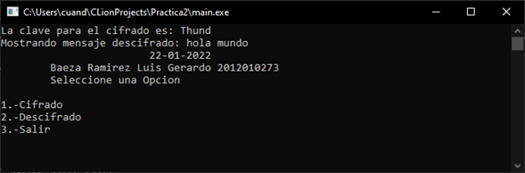
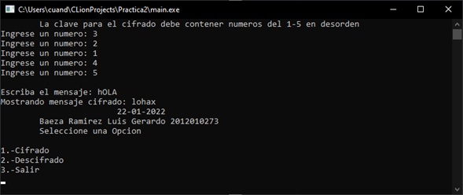
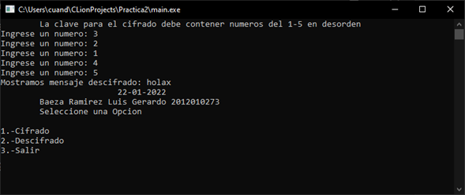

<div class="container">
<div style = "text-align: center;">
    
    <h1>Práctica 2 Algoritmos de Cifrado clasico</h1>
</div>
</div>

|  | Gerardo Baeza Ramirez<br/>[@ThunderGer](https://www.instagram.com/thunderger/) | Seguridad en redes<br/>3TM6<br/>Cyntia Eugenia Enriquez Ortiz |
|--------------------------------------------------------|---------------------------------------------------------------------------|-----------------------------------------------------------|

## Comenzando 🚀

_Acceda al link del repositorio hubicado a continuación [Algoritmos de cifrado](https://github.com/ThunderGer23/Algoritmos-de-cifrado)
y ejecute las instrucciones git clone seguido de la URL del repositorio para realizar una copia en su equipo._

```
git clone https://github.com/ThunderGer23/Algoritmos-de-cifrado
```

## Pre-requisitos 📋

_Se requiere tener instalada alguna versión de gcc (en caso de linux), o lenguaje C en caso de ser Windows.
 Así mismo se recomienda el uso de Dev C++, CLion, CodeBlocks o cualquier otro de su elección para modificar
 y visualizar el código de manera rápida y concisa._

* [Dev C++]()
* [CodeBlocks]()
* [CLion]()

### Entorno 🔧

🚩🚩🚧_Para la correcta ejecución de este programa se recomienda utilizar la versión **C99** de Lenguaje C, siendo la más
 practica y fácil de usar, así mismo es preferible que se ejecute en **Dev C++** o **CodeBlocks**._🚧🚩🚩

_Una vez dentro del entorno procedemos a realizar la compilación y creación del **.exe**._

##Linux 🐧
_En caso de estar trabajando desde un entorno linux, recuerde que puede realizar el siguiente comando para generarlo_

```
 gcc main.c -o codificador
```

_En donde la palabra **codificador** puede ser sustituida por cualquier otro nombre que deseé darle a su archivo
 **.exe**_

##Windows 🎴

_Basta con abrir el archivo en Dev C o CodeBlocks y compilarlo, en mi caso se muestra de la siguiente forma_



## Resultados⚙️

#_Resultados de cifrado Playfire_




#_Resultados del cifrado vigenegere_





#_Resultados del cifrado de transposición_




## Construido con 🛠️

_Este proyecto ha sido realizado con:_

* [CLion](http://www.dropwizard.io/1.0.2/docs/) - El framework web usado
* [C23](https://maven.apache.org/) - Manejador de dependencias
* [Git](https://rometools.github.io/rome/) - Usado para generar RSS

## Wiki 📖

Puedes encontrar mucho más de cómo utilizar este proyecto en nuestra [Wiki](https://github.com/tu/proyecto/wiki)

## Versionado 📌

Usamos [SemVer](http://semver.org/) para el versionado. Para todas las versiones disponibles, mira los [tags en este repositorio](https://github.com/tu/proyecto/tags).

## Autores ✒️

|                                                               | Cyntia Eugenia Enriquez Ortiz                                                  | Seguridad en redes<br/>3TM6                           |
|---------------------------------------------------------------|--------------------------------------------------------------------------------|-------------------------------------------------------|
|       | Arturo Toledo Aguado<br/>[@R2](https://github.com/ArturoEmmanuelToledoAguado)  | Trabajo inicial                                       |
|  | Gerardo Baeza Ramirez<br/>[@ThunderGer](https://www.instagram.com/thunderger/) | Desarrollo de modulos <br>y refactorización de código |


## Licencia 📄

Este proyecto está bajo la Licencia GPL v3 - mira el archivo [LICENSE.md](LICENSE) para detalles

---
## Expresiones de Gratitud 🎁

* A mi mentora [@Lucezas]() ⌨🖥💻🖱🖲. 
* A Alberto y Jose Luis Padilla 🏈🎴.
* A mi novia [@xl.maya](https://www.instagram.com/_xl.maya_/?hl=es-la) por su paciencia y comprensión ❤. 
* A mi esfuerzo constante por mejorar cada día🤓.